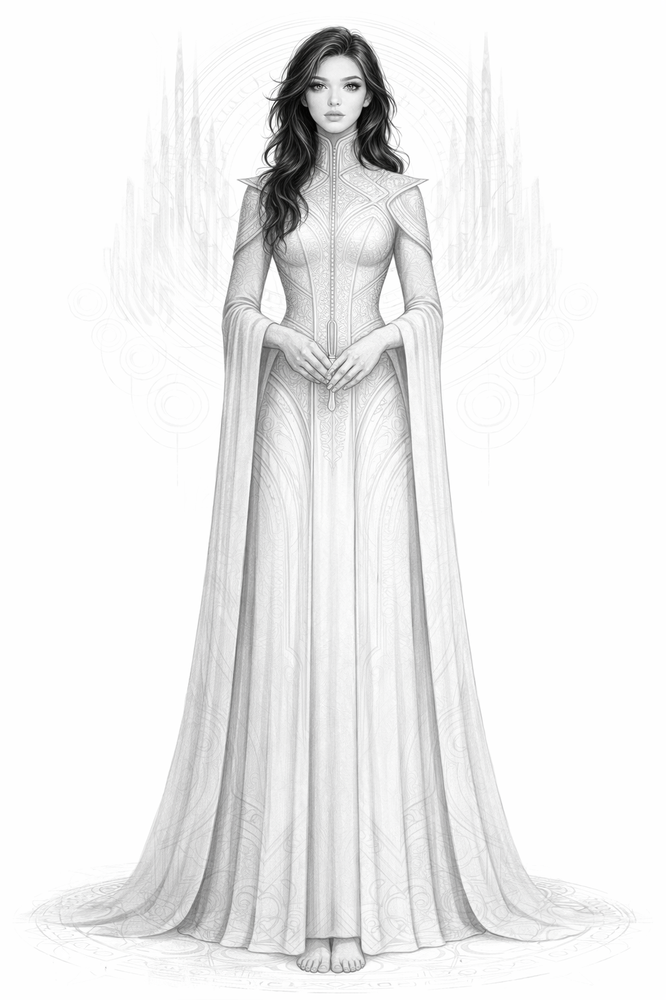
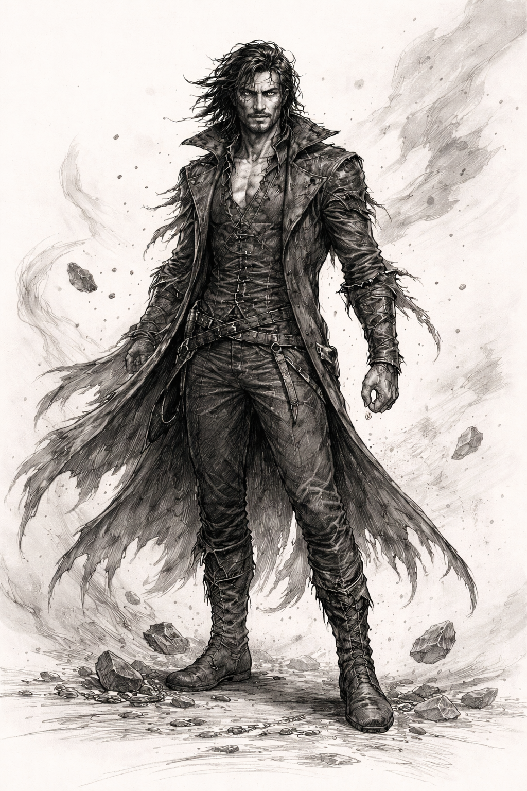
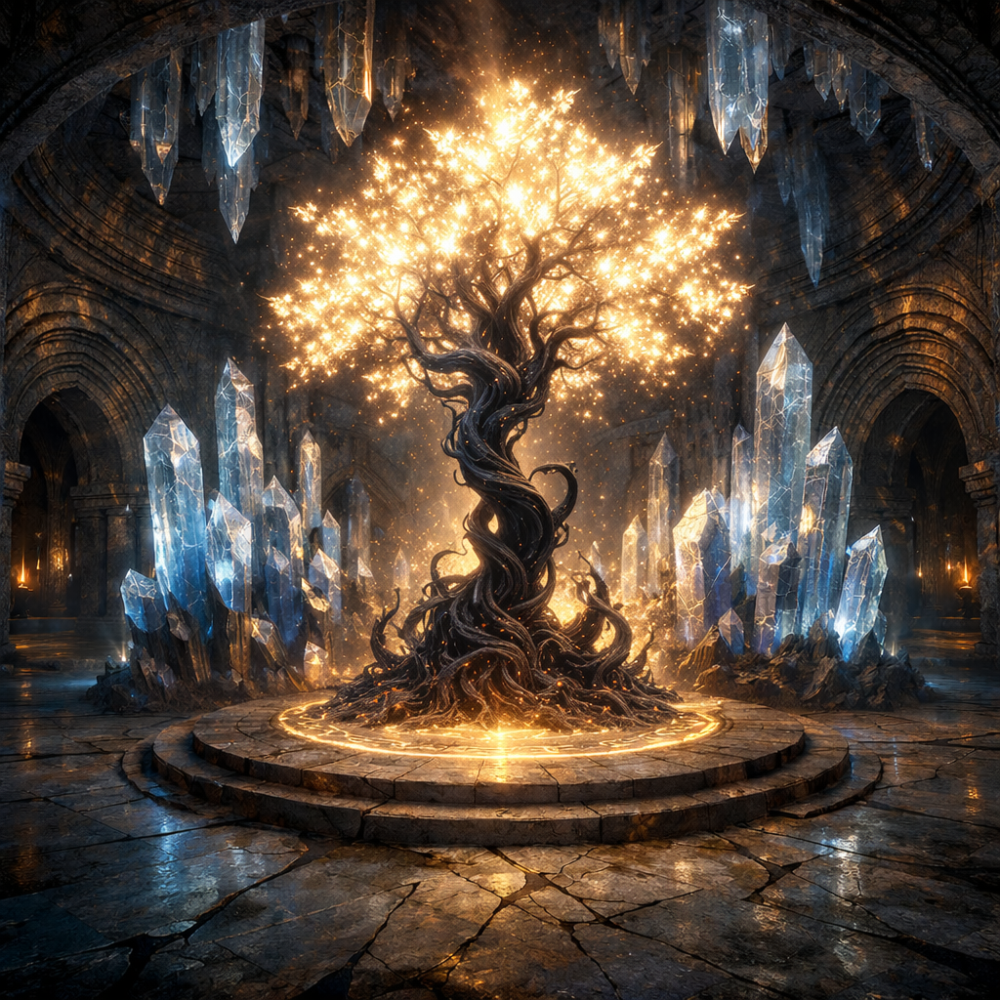
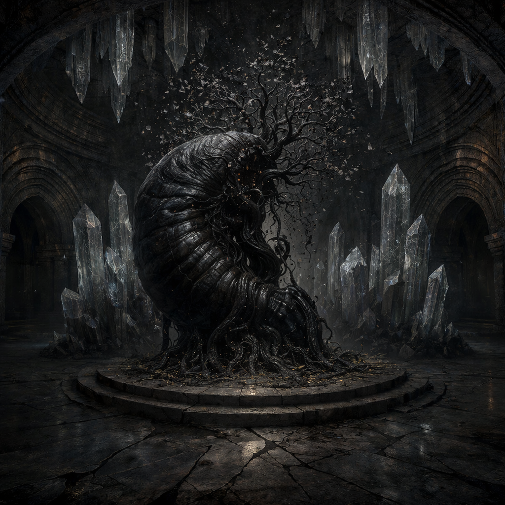

# Catacomb: The Tomb of Tahara — Backstory

## In the Beginning

Long before civilization rose in Tahara, the land was wild and untamed and with it a churning sea of wild magic.

From this, two primordial forces emerged.

**Orinthas** a force of order. She looked upon the wild and saw potential — patterns waiting to be discovered, structures waiting to be built, harmonies waiting to be composed. Orinthas was drawn to sculpting structure the way potter to clay: to shape it into something greater. She studied the wild magic of the land and recognized something remarkable — that it could be arranged into something beautiful with the right instrument.

**Kathesk** was a force of entropy. He looked upon structure and saw constraint — complexity waiting to be simplified, patterns waiting to be unraveled, forms waiting to return to their purest, most elemental state. Where Orinthas created, Kathesk deconstructed.

For a time, Kathesk reigned supreme, the world was mostly raw chaos, and he was happy.

---

## Forging the Cantus

Orinthas, in her pursuit of order, devised a masterwork. A vast network of chambers, tunnels, and halls carved deep beneath the surface of the land, every surface shaped with impossible precision. Every wall angled to catch and redirect sound. Every corridor tuned to a specific resonance. Every chamber a node in an enormous acoustic architecture.

This was the **Cantus**.

The entire structure was the instrument — a cathedral of stone and space designed to take the world's raw and wild magic and tame it... with harmony. Wild magic entered through fissures in the deep earth, passed through the Cantus's labyrinthine passages, and emerged as tuned magic — a stable, sustaining resonance that radiated outward through the land. Wild magic was noise. Tuned magic was the melody that noise became.

You could *feel* the Cantus's tuned magic. A melody beneath everything — under the soil, in the rivers, woven into the wind. Not quite audible, but always present. It nurtured life, enriched the land, and held everything in balance. The land *resonated* with it.

At the heart of the Cantus lay the **Resonance Chamber** — the focal point where all the passages converged. Here, the sound was purest. Standing in the chamber, you could actually hear the melody. The walls, floor, and ceiling were carved with intricate patterns — not decoration, but acoustic architecture, each groove and ridge shaping the sound that passed through. Crystalline formations rose from the floor and descended from the ceiling like the pipes of an organ, each one tuned to sustain a different harmonic. Together, they held the Cantus's endless chord. Orinthas reign was beginning and she was happy.

---

## Tahara in Its Glory

As the Cantus's harmony took hold, the wild land of Tahara tamed and flourished into a place of unmatched beauty and magic. Rolling emerald forests, shimmering rivers, and skies that seemed to hum with an eternal melody made it a paradise for those who called it home. And Orinthas was happy.

In time, people arose in Tahara. Orinthas, recognizing kindred spirits in these pattern-seekers, taught the early inhabitants a profound secret: **tuned magic could be shaped into specific effects through song.**

Certain musical notes, played in certain combinations, resonated with tuned magic that saturated the land. These were frequencies that aligned with the Cantus's own harmonics, and when played correctly, they could focus and direct magic with intent. A melody could soothe a wounded creature. A chord could coax growth from barren soil. A complex composition could mend shattered stone. The people called these compositions **wish songs**. Music itself was everywhere in Tahara but wish songs were different. They were the melodies that the Cantus recognized, and answered.

The people lived in peace and prosperity for centuries, their wish songs intertwining with the Cantus's melody in an ever-growing symphony.  And Kathesk grew concerned.

---

## The Imprisonment of Kathesk

Kathesk had watched Orinthas's work with growing unease. As the Cantus's influence spread, more and more of the world's wild magic was being converted into tuned magic. The wild, formless energy that Kathesk so enjoyed was shrinking. The world was becoming too fixed, too structured, too constricting. For a being that craved dissolution and simplicity, Tahara's flourishing was suffocating. And as the wild magic that was the source of his power dwindled, Kathesk weakened.

Kathesk turned his attention to the Cantus. If it could be unraveled — its patterns broken — the world would return to beautiful.

Orinthas anticipated this. She had always known that Kathesk would eventually come for the Cantus. And so, within the Cantus's design, Orinthas had built something more than an instrument. She had built a trap.

The Cantus was already a labyrinth — but its deepest reaches served a dual purpose. Below and apart from the Resonance Chamber, Orinthas had constructed an entire region of the Cantus devoted to a single function: containment. This was the **Wailing Depths** — a sprawling network of passages, chambers, and harmonic locks designed to imprison a force of nature. Corridors doubled back on themselves. Rooms were cages within cages. And at its center, a prison chamber ringed with chains of solidified sound, resonating at frequencies designed to suppress Kathesk's power.

When Kathesk finally descended into the Cantus, drawn by his desire to silence the melody at its heart, he found himself ensnared. And there he remains — diminished, but not destroyed. A force of entropy cannot be unmade. It can only be contained.

---

## Orinthas at Rest

With Kathesk imprisoned and the Cantus humming in perfect order, Orinthas rested. Still tethered to the instrument she had built, drawing peace and harmony from the Cantus she had no reason to stay vigilant. The work was done. The world was ordered. The Cantus sang on without her.

She slept within the Cantus, and the centuries passed above her.

---

## The Leechling and the Withering

But Orinthas's triumph carried an unintended consequence.

In the depths of the world, there existed a parasitic entity known as the **Leechling** — a dark and terrifying creature that fed on wild magic. For as long as the world had been untamed, the Leechling had gorged itself freely on the abundant wild magic that swirled through everything.

In the old days, Kathesk had unknowingly kept the Leechling at a distance. But with Kathesk imprisoned, the balance shifted. More and more of the world's wild magic was converted into tuned magic, and the wild magic the Leechling depended on grew scarce.

Starving, the Leechling wormed its way to the surface following the faintest threads of wild magic wherever they led. And those threads led, inevitably, to the Cantus.

When the Leechling found the Cantus, it found something far more accessible and far more valuable: the **Resonance Chamber** — the focal point of an engine of immense magical power, converting energy endlessly. The Leechling latched onto the Resonance Chamber and began to feed.

---

## The Withering

What followed was catastrophic.

The Leechling's feeding corrupted the Cantus at its source. The melody beneath everything shifted. What had been a felt harmony became something *wrong*. A dissonance. Music that made your skin crawl. Rhythms that made the heart stutter. The melody was still there, still under everything, but it had turned sour, like a song played in the wrong key by broken hands. And so the tuned magic that flowed from the Cantus was corrupted with it.

This corruption spread outward from the Resonance Chamber like rot through a tree. The people of Tahara called it **the Withering**.

The Cantus was devastated. Harmonic wards disintegrated. The protective constructs — magical guardians Orinthas had designed to protect the Cantus — turned into monstrous abominations that stalked the tunnels they once defended, now hunting anything that moved. Living creatures that remained in the Cantus became twisted into hostile, unrecognizable forms.

And deep within the Cantus, Orinthas woke. Not gently. Not fully. The corrupted tuned magic that saturated her instrument had saturated *her*. She had been so tightly bound to the Cantus that when it twisted, she twisted with it. She rose broken — her mind shattered, her form barely recognizable, her memory scattered into fragments she could not piece together. She did not know her name. She did not know what she had built. She knew only that something was *wrong*, and she could not remember how to fix it. She wandered the tunnels of her own creation, muttering and humming broken scraps of melodies that had once shaped the world. She now was known only as **Murmur**.

Above ground, the Withering spread rapidly. The tuned magic that once preserved and grew life now darkened and twisted everything it touched. The people of Tahara's songs began to fail them. The melodies that had once shaped tuned magic into healing and protection now produced twisted and harmful effects — **curse songs**, born from corrupted magic, wielded by those twisted enough to embrace them. One by one, the true songs fell silent. The connection between the people and the Cantus was severed — or corrupted beyond use.

The land that had once been a paradise became a ruin.

The Cantus, though weakened and corrupted, still hums. Those who are sensitive enough can still feel it — a broken melody beneath the silence, beckoning to those brave — or desperate — enough to venture into the depths.